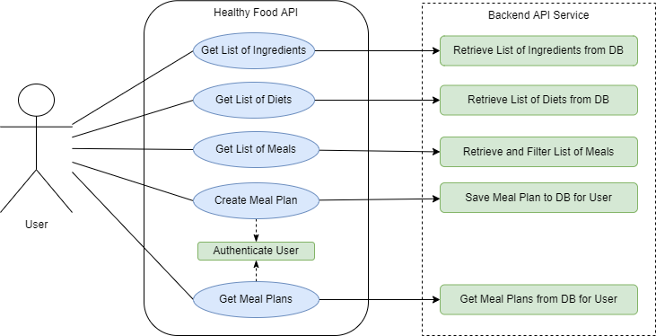
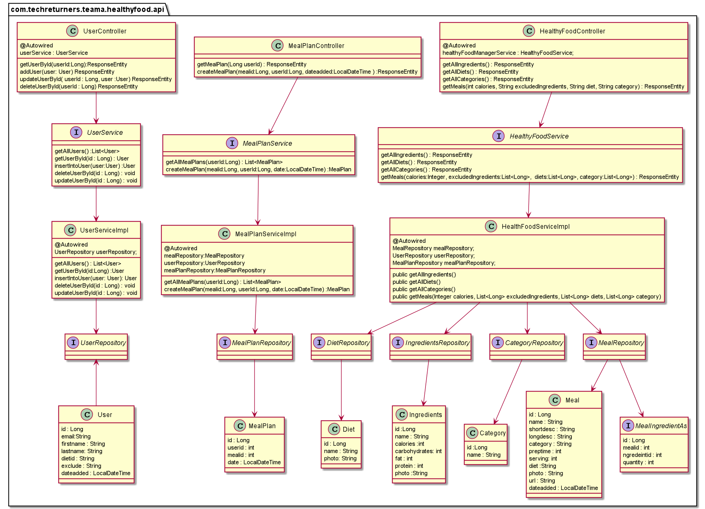
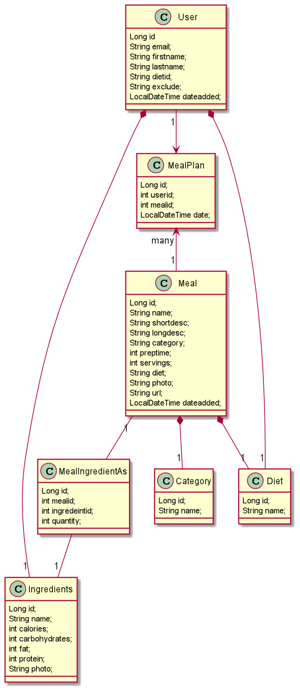
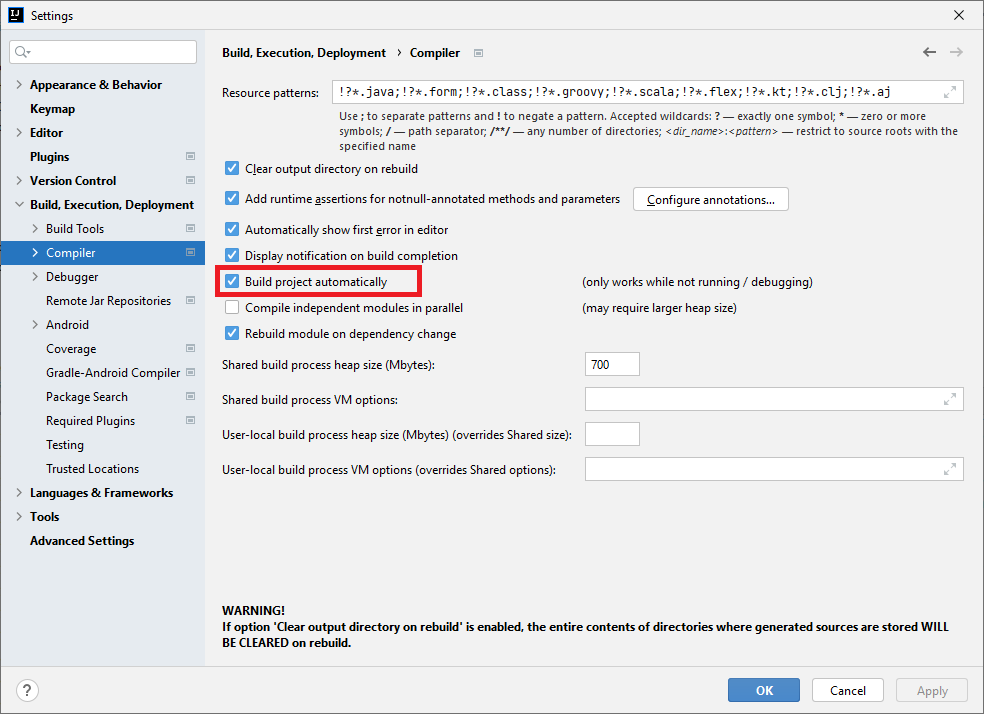
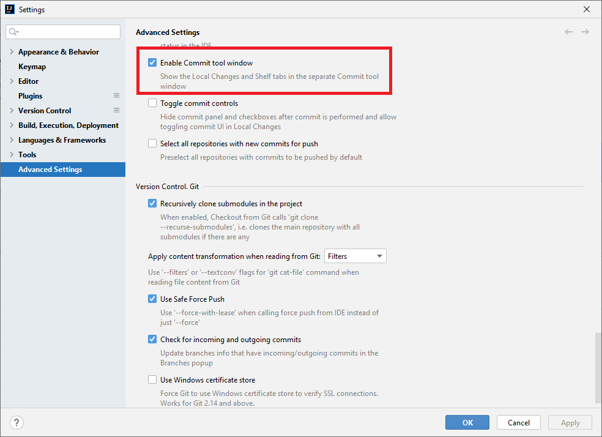

# Healthy Food API
Healthy Food API is designed to create a meal plan for a day based on dietary restrictions. 

The objective of this application is to provide the functionality to fetch different meals and then let the user create a meal plan based on those meals and a date.

The meals can be filtered by the total amount of calories per day, the type of diets and the list of ingredients that the user wants to exclude from his meals.

* Example of diets :  vegan, vegetarian, keto, Dairy-free, gluten-free etc.
* Example of ingredients to exclude :  nuts, mushrooms, peanut, eggs, fish, shellfish etc.

## Research & Analysis
We started by defining what our MVP will be, after some brainstorming, we came up with the following features for our MVP:

* Get list of ingredients to be used for exclusion list.
* Get list of diets.
* Get list of meals.
* Create meal plan based on meals IDs and a day.
* Get meal plan based on user id.
* Store the data using MySql database and H2 for testing.
* Setup a MySQL database in AWS.
* Using Trello for Kanban and Sprinting.
* Daily stand-ups at 10am.
* We will be pairing and also working in individual tasks.

### User-Case Diagram

This diagram shows the high-level functions and scope of our application.

### Class Diagram to exhibit the flow from Controller to Service and Repository

The classes are designed using the MVC pattern.
* Controller will have classes related to endpoints. 
* Service will have interfaces to call the CRUD repository methods.
* Repository has the interfaces related to CRUD.

### Class Diagram for Model

These classes make use of Lombok annotations and JPA.
* The MealIngredientAs class will contain all the ingredients for a particular meal.
* We query the MealIngredeientAs excluding the ingredients which matches the Exclusion list.
* The list of Meal will be returned and further we filter it according to the category and diet.
* This list of Meals is sent to the User.
* User can select meals and add them to particular date as a request.
* Now we insert the selected meal and date inside the MealPlan table.
* We retrieve the saved mealPlan according to the userid.

## API Endpoints

The project is currently configured in Dev to run on SSL under port 8443, so please make sure you follow the instructions in the section below in [How to create and use an SSL certificate locally](#how-to-create-and-use-an-ssl-certificate-locally). 

### For Healthy Food
* **Get all ingredients :** https://localhost:8443/api/v1/ingredient
* **Get all diet types :** https://localhost:8443/api/v1/diet
* **Get all categories :** https://localhost:8443/api/v1/category
* **Get all meals or with dietary restrictions:** https://localhost:8443/api/v1/meal
  * Parameters : calories, ingredients to exclude, diets, category

### For Meal Plan
* **Get meal plans for user :** https://localhost:8443/api/v1/mealplan/{userId}
* **Create meal plan for user :** https://localhost:8443/api/v1/mealplan/{userId}
  * Parameters : meals, date

## API Documentation

The API documentation is automatically generated with Swagger (Open API), you can either view it as JSON or through the UI.

Run the main application and go to:

- User Interface: https://localhost:8443/swagger-ui/index.html
- JSON: https://localhost:8443/v3/api-docs

##  Development Database

For development, the H2 in-memory database is being used. Once the application is running in *dev* mode, the H2 db is initialised and its data is loaded using the *data.sql* file from the resources folder.

In order to interact with the H2 database, you can use the following url: https://localhost:8443/h2-console

## How to create the Production database

If you Fork this project and would like to create your own database in Production (AWS), please follow these steps:

1) Create a publicly accessible MySQL DB in AWS with your own user and password.
2) Add a MySQL inbound security rule in the VPC where the AWS DB is running if you would like your local machine to access it.
3) Update the following properties in the *application-prod.properties* file:
   - user and password (password should be updated in your environment variable)
   - datasource url
4) Connect to MySQL AWS DB and run the following command:
   - `create database healthyfood_database;`
5) Add the following line in the *application-prod.properties* file:
   - `spring.jpa.hibernate.ddl-auto=update`
6) Generate the database schema by running the application.
7) Add data to DB by running the *data.sql* scripts in the project resources folder.
8) Remove the line added in step 5) to avoid any more automatic updates in Production.

## How to create and use an SSL certificate locally

For simplicity, *mkcert*  will be used for making locally-trusted development certificates. Github repo: https://github.com/FiloSottile/mkcert.

The following instructions are for Windows command line:

1) `choco install mkcert` to install mkcert.
2) `mkcert -install` to create a new Certificate Authority (which name will start with mkcert).
3) `mkcert -CAROOT` to know the location of the CA key and certificate (cd to that location).
4) `mkcert localhost 127.0.0.1 ::1` to create the certificate and private key for localhost.
5) `choco install openssl` to install openssl.
6) `openssl pkcs12 -export -out localhost.p12 -in localhost+2.pem -inkey localhost+2-key.pem -passin pass:root -passout pass:root` to convert a PEM certificate to PFX/P12 format so Java can use it.
7) copy your p12 file from step 6) to the *resources* folder.
8) now you are ready to run the application under https://localhost:8443/, as all the ssl configuration was already added to the spring boot *dev* profile.

**Note**: If you are using Postman for local testing, please make sure you add your CA certificate (PEM file) under File/Settings/Certificates.

## Automatic Server Restart

Spring Boot DevTools module has been added to the project to allow automatic server restart when there is a code change in the classpath while you are developing. This is quite useful because you don't need to rebuild and run the server manually every time there is change.

In order for this feature to work in IntelliJ, the following settings need to be enabled:

|  |  |
| --- | --- |
|  |  |

There are more options that can be used from this module, if you want to learn more, please refer to: https://howtodoinjava.com/spring-boot/developer-tools-module-tutorial/

## Technologies & Dependencies
- Spring Boot 2.6.7
- Spring Boot Starter Web
- Spring Boot Starter Test
- Spring Boot Starter Actuator
- Spring Boot Starter Data JPA
- Spring Boot DevTools
- Springdoc OpenAPI UI 1.6.8
- Java 17.0.2
- Maven 3.8.5
- JUnit 5.8.2
- Lombok 1.18.24
- Mockito 4.0
- H2 Database 1.4.2
- MySql Connector 8.0.28
- Jackson Data Types JSR310 2.13.2
- IntelliJ 2021.3.2 (Community Edition)

## How to run the application
  * cd to the project root folder in the command line
  * `mvn compile`
  * `mvn exec:java -Dexec.mainClass=HealthyfoodApplication`

To run tests use:
- `mvn test`

### Run as a Docker container

The project is currently configured in Dev to run on SSL under port 8443, for the following instructions to work you will need to disable ssl in *application-dev.properties* and change server port to 8080.

* cd to the project root folder in the command line
* `docker build -t healthy-food-api:1.0 .`
* `docker run -p 8080:8080 healthy-food-api:1.0`
* now you can go to: http://localhost:8080/swagger-ui/index.html

To stop container:

* press CTRL + C or
* kill it from another command line by using:
  * `docker ps` (to get the id of the running container)
  * `docker stop <container id>`

